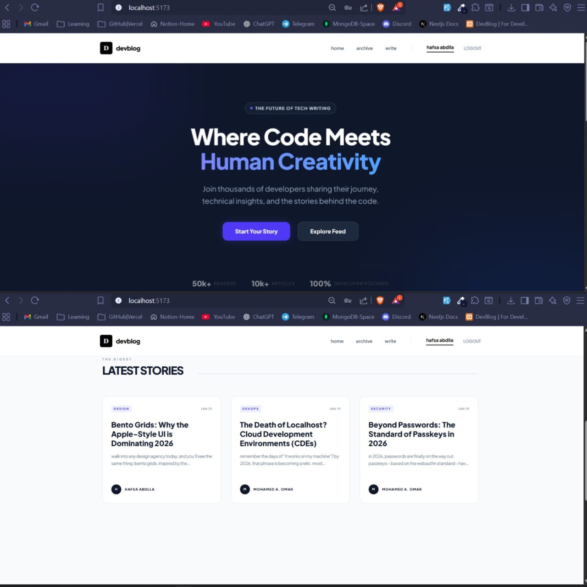
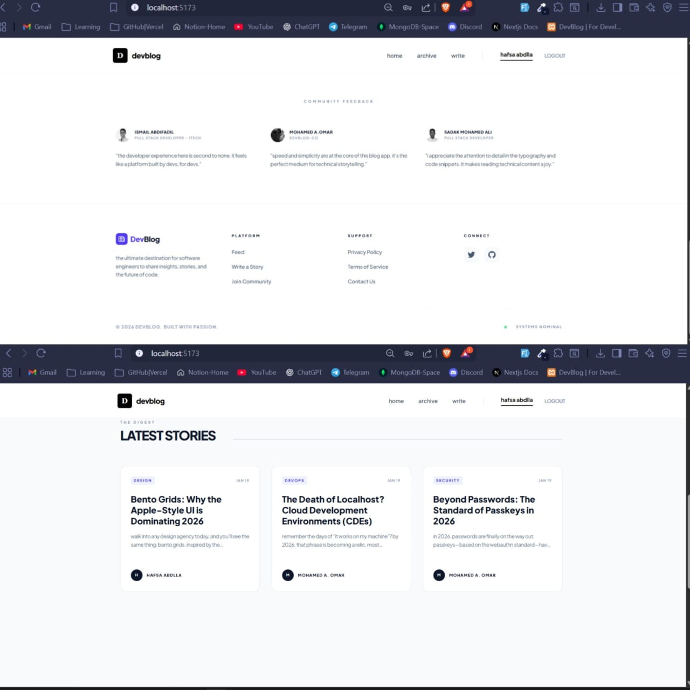

# 🚀 DevBlog - Modern MERN Stack Blog

A sleek, responsive, and high-performance blog application built with the MERN stack (MongoDB, Express, React, Node.js). Featuring a minimalist design, full authentication, and a custom-built mobile-first UI.

## 🔗 Live Demo
- **Frontend:** [https://blog-frontend-phi-silk.vercel.app](https://blog-frontend-phi-silk.vercel.app)
- **Backend API:** [https://blog-backend-72ss.onrender.com](https://blog-backend-72ss.onrender.com)

---

## 📱 Project Preview
Below are the latest screenshots of the platform's responsive design:

| Desktop View | Mobile Drawer |
| :--- | :--- |
|  |  |

---

## ✨ Features
* **Full CRUD:** Create, Read, Update, and Delete blog posts.
* **JWT Authentication:** Secure login and registration system.
* **Custom UI:** Built with Tailwind CSS featuring a "glassmorphism" navbar and slide-down mobile drawer.
* **Express 5 Ready:** Optimized for the latest Express routing standards.
* **Responsive Design:** Fully optimized for mobile, tablet, and desktop screens.
* **Database Integration:** Powered by MongoDB Atlas with Mongoose modeling.

## 🛠️ Tech Stack
- **Frontend:** React 18, Tailwind CSS, React Router 6, Axios.
- **Backend:** Node.js, Express 5, JWT (JSON Web Tokens).
- **Database:** MongoDB Atlas.
- **Deployment:** Vercel (Frontend) & Render (Backend).

---

## 🚀 Installation & Local Development

1. **Clone the repository:**
   ```bash
   git clone [https://github.com/Amen252/blog-backend.git](https://github.com/Amen252/blog-backend.git)